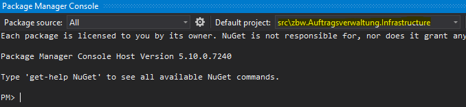

# Contribute

## Task Management
The Taskmanagement is conducted on a Trello Board [Here](https://trello.com/b/JtoMNw8M/zbwprogadvauftragsverwaltung).

Contact [**Michael Huber**](https://github.com/mihl9) to gain access to the board!

## Project Structure
    .github/workflows                           # CI / CD Action files for Github
    src/                                        # Contains the Project for the Solution
        zbw.Auftragsverwaltung.Api/                 
        zbw.Auftragsverwaltung.Core/                
        zbw.Auftragsverwaltung.Infrastructure/      
        zbw.Auftragsverwaltung.WebApp/              
    tests/                                     # Unit Test Projects
    mkdocs.yml                                 # The MKDoc configuration file.
    docs/
        index.md                               # The Main Page.
        ...                                    # Other markdown pages, images and other files.

### zbw.Auftragsverwaltung.Api
REST API: Implementation, wrapper for the Core implementation

    zbw.Auftragsverwaltung.Api/                 
        Common/                 # Basic Implementations and Models for the API
        *{Domain}*/             # The Implementation is seperated through Domains and built accordingly
            Controller.cs       # The REST API Implementation
        Dockerfile              # Docker build definition

This Project may include:
    
    - REST Api definitions
    - Swagger Implementation
    - ...

### zbw.Auftragsverwaltung.Core
This is the core Project => Main component for the Application

    zbw.Auftragsverwaltung.Core/                
        Common/                     # Contains default Implementations for the Project
            Configurations/         # Contains the Configuration Models for the Application
            Contracts/              # Contains default Interfaces for the Data Contracts (Repositories)
            Dto/                    # Contains default or basic Data Transfer Objects
            Exceptions/                         
            Helpers/                # Helper Classes for the Core Application
            Interfaces/             # Basic Interfaces which can't be assigned to the other categories
        *{Domain}*/                 # The Implementation is seperated through Domains and built accordingly
            BLL/                    # Business logic Implementation of the *{Domain}*
            Contracts/              # Contains the definitve interfaces for the Data Contacts (Repositories)
            Dto/                    # Dto for the entites in the current *{Domain}*
            Entites/                # Basic Entities for the *{Domain}* implementation
            Interfaces/             # Interfaces which can't be assigned to the other categories
            Profiles/               # Contains Mapping profiles for the Automapper
        CoreRegistrationService.cs  # Contains the Service registration calls for the DI Service Provider

This Project may include:

    - interfaces
    - Services
    - DTOs
    - BLL (Business Logic Layer)
This Project includes relevant Processes and implementation for the Project and will therefore be testet with Unit Tests

### zbw.Auftragsverwaltung.Infrastructure
This Project Contains wrappers for external Services and Database Implementation for the data Persistence

    zbw.Auftragsverwaltung.Infrastructure/      
        Common/                               # Contains default Implementations for the Project
            Repositories/BaseRepository.cs    # Base Implementation of a Repository which access an EF Database Context
        *{Domain}*/                           # The Implementation is seperated through Domains and built accordingly
            DAL/                              # Contains the Data Access Layers for this domain (Repositories)
        InfrastructureServiceRegistration.cs  # Contains the Service registration calls and DB Context registrations for the DI Service Provider 
        OrderManagementContext.cs             # The Database Context for the Order Management
        UserIdentityContext.cs                # The Database Context for the Identity Management

This Project may include:
    
    - Caching
    - EF Core DbContext
    - Redis Implementation (part of caching and messaging)
    - Third Party Serrvices (Git Hub)
    - Email and SMS Messaging
    - File Logger
    - Other external dependencies
    - Repository Pattern (DAL, Data Access Layer)

This Project will be testet in part of the Integration Tests

### zbw.Auftragsverwaltung.WebApp
    
    TODO
    
## Database Migrations
When you made changes for the database model you need to perfom the Migrations to apply the changes for EF Core
To Ensure a safe way to safely evolve the schema without dropping the entire database.

!!! information "Requirements"
    You'll have to install the [EF Core Command-line tools](https://docs.microsoft.com/en-us/ef/core/cli/)
    
    - It is recommended to use the *.Net Core CLI tools*, which works on all platforms
    - If you want to only work with Visual Studio you can use the [Package Manager Console tools](https://docs.microsoft.com/en-us/ef/core/cli/powershell)

### Create Migration
To create a migration you have the following options to use

=== ".Net Core CLI"
    
    ```
    $ dotnet ef migrations add SpecificMigration -c YourDBContext
    ```
=== "Visual Studio"
    
    To use the Packet Manager Console you need to set the default project to *src\zbw.Auftragsverwaltung.Infrastructure*
    
    

    then you can run the following command
    
    ```
    $ add-migration SpecificMigration -c YourDbContext
    ```

## Development Test Users
When the Project is run in Debug Mode there will be some default Users available.
 
 - testadministrator : Test@1

 - testuser : Test@1